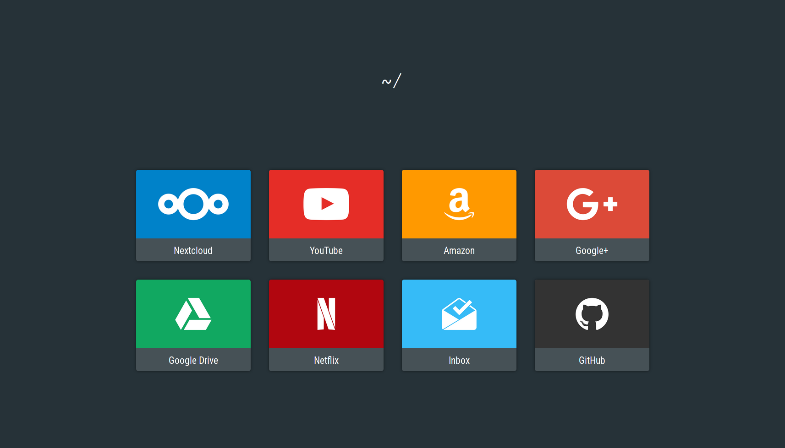

# MyFirefoxHome



A simple new tab / home page for firefox with my main favorites.

## How to install it

First clone this repo:

```bash
git clone https://github.com/GabMus/MyFirefoxHome
```

Then install [this Firefox addon](https://addons.mozilla.org/en-US/firefox/addon/new-tab-override/).

Finally select the index.html file inside the cloned repo.

It's that simple.